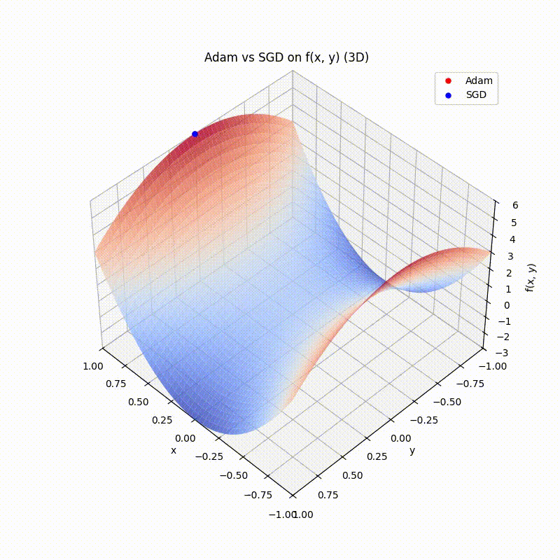

When training deep neural networks, choosing the right optimizer can make the difference between fast, stable convergence and hours of frustration. One of the most widely used algorithms is **Adam (Adaptive Moment Estimation)**, introduced by [Diederik P. Kingma and Jimmy Ba in 2014](https://arxiv.org/abs/1412.6980). Adam has become the default optimizer in many frameworks (PyTorch, TensorFlow, JAX) and is still at the heart of cutting-edge models like transformers.

---

## The Idea Behind Adam

Adam combines two key ideas from earlier optimizers:

1. **Momentum**
   Momentum smooths the path of gradient descent by keeping a moving average of past gradients. If the slope keeps pointing in the same direction, the update accelerates (like a ball picking up speed as it rolls downhill). This reduces jitter and helps escape shallow valleys.

2. **Adaptive step sizes (RMS scaling)**
   Inspired by RMSProp, Adam keeps track of the average magnitude of past squared gradients. This lets it scale the learning rate per parameter:

   * Large gradients → smaller step size (be cautious).
   * Small gradients → larger step size (be bold).

By combining these two, Adam adapts both **direction** (via momentum) and **step size** (via RMS scaling) dynamically.

---

## The Update Rule

At each step $t$, given the gradient $g_t$:

$$
m_t = \beta_1 m_{t-1} + (1-\beta_1) g_t
$$

$$
v_t = \beta_2 v_{t-1} + (1-\beta_2) g_t^2
$$

Bias corrections (important for the early steps):

$$
\hat{m}_t = \frac{m_t}{1-\beta_1^t}, \quad \hat{v}_t = \frac{v_t}{1-\beta_2^t}
$$

Parameter update:

$$
\theta_{t+1} = \theta_t - \alpha \frac{\hat{m}_t}{\sqrt{\hat{v}_t} + \varepsilon}
$$

Defaults:
$\alpha = 0.001, \beta_1 = 0.9, \beta_2 = 0.999, \varepsilon = 10^{-8}$.

---

## Intuition Recap

* **Momentum ($m_t$)**: If gradients keep pointing in the same direction, accelerate.
* **RMS scaling ($v_t$)**: If gradients have been large, slow down; if they’ve been small, speed up.
- **Bias correction**: Prevents the early averages (which start at zero) from underestimating the true signal.
---

## Adam vs. SDG

Let's compare Adam with stochastic gradient descent (SDG).
The 3D plot shows the Rosenbrock function’s characteristic banana-shaped valley
as a surface. The optimization trajectories are overlaid above the surface for
clarity. The **Adam optimizer (red)** quickly moves along the valley and
reaches the minimum first, demonstrating its fast convergence in this setup.
The **SGD optimizer (green)** progresses more gradually, following a smoother
path toward the minimum but taking longer to converge.

See my [Github](https://github.com/itsfernn/ml-daily-challenge/blob/main/adam/adam.ipynb) for the Code.

---

## Limitations of Adam

Adam isn’t perfect:

1. **Generalization gap**
   On tasks like image classification, Adam often converges faster than SGD but to sharper minima, leading to worse test accuracy.

2. **Non-convergence in theory**
   The original Adam can fail to converge in certain convex problems. Variants like **AMSGrad** fix this.

3. **Weight decay issue**
   L2 regularization (weight decay) doesn’t behave properly in Adam, since the penalty term is scaled by the adaptive learning rate. The **AdamW** variant decouples weight decay, making it the optimizer of choice in modern NLP.

## Reference

* D. P. Kingma and J. Ba. *Adam: A Method for Stochastic Optimization*. 2014. [arXiv:1412.6980](https://arxiv.org/abs/1412.6980)
