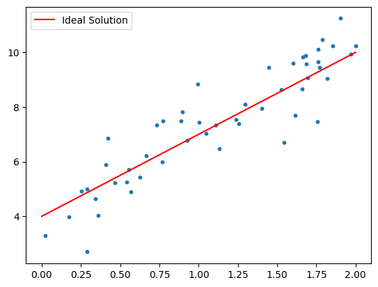
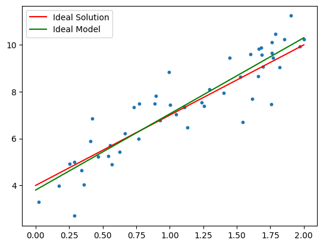

Linear regression is a fundamental supervised learning algorithm used to model the relationship between a dependent variable $y$ and one or more independent variables $x$. In its simplest form (univariate linear regression), it assumes that the relationship between $x$ and $y$ is linear and can be described by the equation:

$$ \hat y = k \cdot x + d $$

But we can have arbitrarly many input features, as long as they are a linar combination in the form:
$$ \hat y = w_0 + w_1 x_1 + w_2 x_2 … w_n x_n$$


```python
import numpy as np
import matplotlib.pyplot as plt
```


```python
# Setup artificial data
num_points = 50
k = 3
d = 4

x = 2 * np.random.rand(num_points,1)
noise = np.random.normal(scale=0.8, size=x.shape)
y = d + k * x + noise
```


```python
# Plot data
def plot_data():
    fig, ax = plt.subplots()
    ax.scatter(x, y, s=10)
    ax.plot([0, 2], [d, 2 * k + d], color="red", label="Ideal Solution")
    ax.legend()
    return fig, ax

plot_data()
plt.show()
```





Even with the ideal parameters, the model doesn't perfectly fit the data due to the added Gaussian noise.

## Mean Squared Error

The model's performance is commonly evaluated using Mean Squared Error (MSE):
$$MSE=\frac 1 n \sum_{i=1}^n (y_i−\hat y_i)^2$$


```python
def mean_squared_error(y, y_hat):
    return np.sum((y - y_hat)**2)/ y.shape[0]

y_ideal = d + k * x

print("Mean Squared Error: ", mean_squared_error(y, y_ideal))
```

    Mean Squared Error:  0.6149312404134968


Even the ideal model incurs some error due to noise.

---

### Closed-Form Solution (Normal Equation)

In practice, the true parameters $k$ and $d$ are unknown. Fortunately, there exists a closed-form solution using linear algebra. First, we express the model as:

$$
\hat{\mathbf{Y}} = \mathbf{X} \mathbf{w}
$$

Where:

* $\mathbf{X}$ is an $n \times (d+1)$ matrix with a column of ones for the intercept term.
* $\mathbf{w}$ is a vector of model parameters.
* $\hat{\mathbf{Y}}$ is the vector of predictions.

The loss function becomes:

$$
J(\mathbf{w}) = \|\mathbf{y} - \mathbf{Xw}\|^2
$$

Setting the gradient to zero and solving yields the **normal equation**:

$$
\mathbf{w} = (\mathbf{X}^T \mathbf{X})^{-1} \mathbf{X}^T \mathbf{y}
$$


```python
# adding column of ones to X
ones = np.ones((x.shape[0], 1))
X = np.hstack((ones, x))
```


```python
# calculating ideal w and predicting y values
w = np.linalg.inv(X.T @ X) @ X.T @ y
Y_hat = X @ w
mean_squared_error(y, Y_hat)
```


    np.float64(3.457589455007784)


```python
fig, ax = plot_data()
ax.plot([0,2], [w[0], w[1]*2 + w[0]], color="green", label="Ideal Model")
ax.legend()
plt.show()
```





## Applying Linear Regression to Real Data

Let’s now apply linear regression to a real-world dataset: **California Housing**, using `sklearn.linear_model.LinearRegression`.


```python
from sklearn.datasets import fetch_california_housing
from sklearn.linear_model import LinearRegression
from sklearn.model_selection import train_test_split

data = fetch_california_housing(as_frame=True)
df = data.frame
df
```


<div>
<style scoped>
    .dataframe tbody tr th:only-of-type {
        vertical-align: middle;
    }

    .dataframe tbody tr th {
        vertical-align: top;
    }

    .dataframe thead th {
        text-align: right;
    }
</style>
<table border="1" class="dataframe">
  <thead>
    <tr style="text-align: right;">
      <th></th>
      <th>MedInc</th>
      <th>HouseAge</th>
      <th>AveRooms</th>
      <th>AveBedrms</th>
      <th>Population</th>
      <th>AveOccup</th>
      <th>Latitude</th>
      <th>Longitude</th>
      <th>MedHouseVal</th>
    </tr>
  </thead>
  <tbody>
    <tr>
      <th>0</th>
      <td>8.3252</td>
      <td>41.0</td>
      <td>6.984127</td>
      <td>1.023810</td>
      <td>322.0</td>
      <td>2.555556</td>
      <td>37.88</td>
      <td>-122.23</td>
      <td>4.526</td>
    </tr>
    <tr>
      <th>1</th>
      <td>8.3014</td>
      <td>21.0</td>
      <td>6.238137</td>
      <td>0.971880</td>
      <td>2401.0</td>
      <td>2.109842</td>
      <td>37.86</td>
      <td>-122.22</td>
      <td>3.585</td>
    </tr>
    <tr>
      <th>2</th>
      <td>7.2574</td>
      <td>52.0</td>
      <td>8.288136</td>
      <td>1.073446</td>
      <td>496.0</td>
      <td>2.802260</td>
      <td>37.85</td>
      <td>-122.24</td>
      <td>3.521</td>
    </tr>
    <tr>
      <th>3</th>
      <td>5.6431</td>
      <td>52.0</td>
      <td>5.817352</td>
      <td>1.073059</td>
      <td>558.0</td>
      <td>2.547945</td>
      <td>37.85</td>
      <td>-122.25</td>
      <td>3.413</td>
    </tr>
    <tr>
      <th>4</th>
      <td>3.8462</td>
      <td>52.0</td>
      <td>6.281853</td>
      <td>1.081081</td>
      <td>565.0</td>
      <td>2.181467</td>
      <td>37.85</td>
      <td>-122.25</td>
      <td>3.422</td>
    </tr>
    <tr>
      <th>...</th>
      <td>...</td>
      <td>...</td>
      <td>...</td>
      <td>...</td>
      <td>...</td>
      <td>...</td>
      <td>...</td>
      <td>...</td>
      <td>...</td>
    </tr>
    <tr>
      <th>20635</th>
      <td>1.5603</td>
      <td>25.0</td>
      <td>5.045455</td>
      <td>1.133333</td>
      <td>845.0</td>
      <td>2.560606</td>
      <td>39.48</td>
      <td>-121.09</td>
      <td>0.781</td>
    </tr>
    <tr>
      <th>20636</th>
      <td>2.5568</td>
      <td>18.0</td>
      <td>6.114035</td>
      <td>1.315789</td>
      <td>356.0</td>
      <td>3.122807</td>
      <td>39.49</td>
      <td>-121.21</td>
      <td>0.771</td>
    </tr>
    <tr>
      <th>20637</th>
      <td>1.7000</td>
      <td>17.0</td>
      <td>5.205543</td>
      <td>1.120092</td>
      <td>1007.0</td>
      <td>2.325635</td>
      <td>39.43</td>
      <td>-121.22</td>
      <td>0.923</td>
    </tr>
    <tr>
      <th>20638</th>
      <td>1.8672</td>
      <td>18.0</td>
      <td>5.329513</td>
      <td>1.171920</td>
      <td>741.0</td>
      <td>2.123209</td>
      <td>39.43</td>
      <td>-121.32</td>
      <td>0.847</td>
    </tr>
    <tr>
      <th>20639</th>
      <td>2.3886</td>
      <td>16.0</td>
      <td>5.254717</td>
      <td>1.162264</td>
      <td>1387.0</td>
      <td>2.616981</td>
      <td>39.37</td>
      <td>-121.24</td>
      <td>0.894</td>
    </tr>
  </tbody>
</table>
<p>20640 rows × 9 columns</p>
</div>


This dataset contains multiple features to predict `MedHouseVal` (median house value), making the model more complex but also harder to visualize.

### Train/Test Split and Model Training


```python
X = data.data
y = data.target

X_train, X_test, y_train, y_test = train_test_split(X, y, test_size=0.2, random_state=42)

model = LinearRegression()
model.fit(X_train, y_train)

y_test_hat = model.predict(X_test)
mse = mean_squared_error(y_test, y_test_hat)

print("Mean Squared Error:", mse)
```

    Mean Squared Error: 0.5558915986952444


## Visualizing Predictions

To visualize the model’s predictions geographically, we’ll plot latitude and longitude, coloring by `MedHouseVal`.


```python
y_hat = model.predict(X)
```


```python
fig, (ax1, ax2) = plt.subplots(ncols=2, figsize=(12, 5), constrained_layout=True)

# First plot — true values
sc1 = ax1.scatter(df["Longitude"], df["Latitude"], c=df["MedHouseVal"], cmap="viridis", s=5)
ax1.set_xlabel("Longitude")
ax1.set_ylabel("Latitude")
ax1.set_title("Actual Median House Values")

# Second plot — predicted values
sc2 = ax2.scatter(df["Longitude"], df["Latitude"], c=y_hat, cmap="viridis", s=5)
fig.colorbar(sc2, ax=ax2, label="Value")
ax2.set_xlabel("Longitude")
ax2.set_ylabel("Latitude")
ax2.set_title("Predicted Median House Values")

plt.show()
```


The model captures the overall trend but struggles with high-value regions, indicating that a linear model may not be expressive enough for all nuances in the data. We'll explore more powerful models in future challenges.
