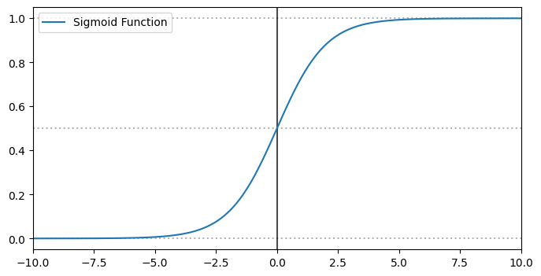

Regression methods aren’t just for predicting continuous values—they can also be used for classification. The simplest example of this is **Logistic Regression**, where we train a linear model to separate two classes in feature space. The goal is for the model to output `1` if an input belongs to our target class and `0` otherwise.

The formula for logistic regression should look familiar if you’ve seen the post on Linear Regression:

$$
\hat{p} = \sigma(\theta^T \cdot x)
$$

We scale each input feature $x_i$ by a corresponding weight $\theta_i$, plus a bias term. The key difference here is that we apply a special function, $\sigma$, to the output. This is the **logistic function**, also called the **sigmoid function**, which maps the result to a probability (i.e., a value between 0 and 1):

$$
\sigma(t) = \frac{1}{1 + \exp(-t)}
$$




The decision boundary lies at $0.5$. That means the predicted label $\hat{y}$ is `1` if $\hat{p} > 0.5$, and `0` otherwise.

---

## Training

To train a logistic regression model, we want it to output **high probabilities** for positive samples ($y = 1$) and **low probabilities** for negative samples ($y = 0$). The loss function for a single prediction looks like this:

$$
c(\theta) =
\begin{cases}
    -\log(\hat{p}) & \text{if } y = 1 \\ 
    -\log(1 - \hat{p}) & \text{if } y = 0
\end{cases}
$$

This can be combined into a single expression:

$$
c(\theta) = - \left( y \cdot \log(\hat{p}) + (1 - y) \cdot \log(1 - \hat{p}) \right)
$$

Unfortunately, there’s no closed-form solution for this cost function. However, the good news is that it’s **convex**, which means we can use **gradient descent** to find the global minimum.

The gradient of the cost function with respect to each parameter $\theta_j$ is:

$$
\frac{\partial}{\partial \theta_j} = \left( \sigma(\theta^T \cdot x) - y \right) \cdot x_j
$$

---

## In Practice

Let’s see how this works on a real dataset: the famous **Iris dataset** from `scikit-learn`. It contains features of 150 iris flowers across three species. We'll try to differentiate one species—**Iris Virginica**—from the others using logistic regression.

We’ll start by using only one feature: **petal width**.


```python
from sklearn import datasets
from sklearn.linear_model import LogisticRegression

iris = datasets.load_iris()
X = iris["data"][:,3].reshape(-1,1)
y = (iris["target"] == 2).astype(int)

log_reg = LogisticRegression()
log_reg.fit(X,y)
```

    

    


As petal width increases, the probability of the sample being Virginica also increases. The vertical dashed line shows the decision boundary. You can see how the model draws a clean line between the two classes based on this single feature.

---

Now let’s try using **two features**: petal width and petal length.


```python
X = iris["data"][:, [2, 3]] 
y = (iris["target"] == 2).astype(int)

log_reg = LogisticRegression()
log_reg.fit(X, y)
```


This plot shows the samples based on their petal width and length. The dashed decision boundary separates the two classes. The closer a point is to the boundary, the more uncertain the prediction. You can also spot a few **misclassified samples**, where the model makes an incorrect prediction.

---

## Summary

Logistic Regression is a simple yet powerful method for binary classification. It models probabilities using the sigmoid function and is trained using a convex loss function, making optimization relatively straightforward with gradient descent.

It’s often a great starting point for classification problems—and as you've seen with the Iris dataset, it can be surprisingly effective even with just one or two features.
