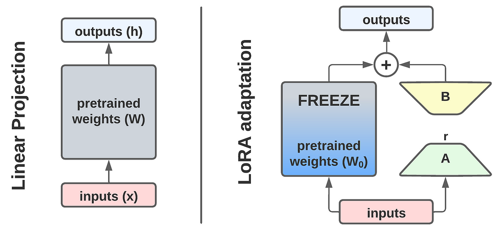

# LoRA (Low-Rank Adaptation)

LoRA, short for **Low-Rank Adaptation**, is one of the most popular *parameter-efficient fine-tuning* (PEFT) methods. It was first proposed by **[Hu et al., 2021](https://arxiv.org/pdf/2106.09685)**, and has become a go-to technique when adapting large pretrained models to new tasks.

Why do we need PEFT methods in the first place?
Finetuning large language models in the traditional way—updating all of their billions of parameters—is simply too expensive in terms of compute, memory, and storage. Researchers realized that we don’t actually need to change every parameter of a pretrained model to make it useful for new tasks.

This idea was first explored in **[Houlsby et al., 2019](https://arxiv.org/pdf/1902.00751)** with their influential *adapter* paper. They showed that instead of retraining the entire model, we can insert small trainable modules (adapters) that steer the model’s behavior while leaving the pretrained weights frozen. This kicked off the PEFT era.

---

## Why LoRA?

LoRA improves upon adapters in a very elegant way. Instead of adding entire new modules, LoRA injects low-rank matrices into existing weight updates. This has several advantages:

* **Fewer parameters**: LoRA can reduce the number of trainable parameters even further compared to adapters.
* **No extra latency**: Since LoRA modifies existing weight matrices directly, there’s no runtime penalty. It acts more like a *patch* than a separate component.
* **Reversible updates**: Applying LoRA is simple—you add the low-rank “patch” to the original weights. To restore the original model, you just remove it.

This efficiency and simplicity explain why LoRA has become so widely adopted in the LLM community.

## What is LoRA?



LoRA is deceptively simple to understand. The key idea is this: **we don’t need to change all the parameters of a pretrained model**, because the model already encodes a huge amount of knowledge. Instead, we can apply a *small patch* that shifts the model’s behavior in the desired direction.

Every transformer model is built from components such as **attention blocks** and **MLPs**. If we zoom in, these components are nothing more than weight matrices, usually denoted as $W_0$. A straightforward fine-tuning update would be:

$$
W = W_0 + \Delta W
$$

But if we allow $\Delta W$ to be a full matrix for *all* weights in the model, we are essentially just fine-tuning again — which defeats the purpose. LoRA introduces two crucial insights to make this efficient:

1. **Target only specific matrices**
   We don’t need to apply LoRA to every weight matrix. In the original paper, after experimenting with different choices, Hu et al. focused on the **query ($W_q$) and value ($W_v$) projection matrices** in the attention block. This already gave strong performance while reducing cost.

2. **Use low-rank factorization**
   Instead of learning a full $d \times d$ matrix for $\Delta W$, LoRA learns two much smaller matrices:

   * a **down-projection** of size $d \times r$
   * an **up-projection** of size $r \times d$

   Together, these approximate the effect of a full-rank update but require far fewer parameters.

The second insight is motivated by the observation that **large overparameterized models have low intrinsic dimensionality**. In other words, their learned functions lie on a lower-dimensional subspace. This means we don’t need to update all dimensions to adapt the model effectively.

Remarkably, the LoRA paper shows that the rank $r$ can be extremely small — even **rank-1** adaptations still produced meaningful improvements!

## Do you need to implement LoRA from scratch?

Not at all! While it’s a great learning exercise to implement LoRA from scratch (and we’ll walk through that in this post), you don’t have to reinvent the wheel. There are already excellent libraries that support LoRA and other PEFT methods.

Some of the most popular options include:

* **[Hugging Face PEFT](https://huggingface.co/docs/peft/index)** — integrates with the Hugging Face ecosystem and supports LoRA, adapters, and other techniques.
* **[Adapters](https://adapterhub.ml)** — a standalone library focusing on adapter-based PEFT methods.

These libraries make it easy to apply LoRA with just a few lines of code. In this blog post we will expore a from scratch implementation for the sake of learning.

### LoRA wrapper for `nn.Linear`

This class takes a pretrained `nn.Linear` layer and augments it with a LoRA branch while keeping the original weights frozen. The frozen base layer, `self.base`, performs the usual linear transformation $y = W_0 x$. Instead of updating this weight matrix directly, LoRA adds a low-rank update on top.

The update is built from two small matrices. The first, $A$, is a down-projection that reduces the input dimension $d$ to a much smaller rank $r$. The second, $B$, is an up-projection that maps back from $r$ to $d$. Together they approximate $\Delta W$ as $B \cdot A$. Because $r$ is typically very small, this drastically reduces the number of trainable parameters. The effect of the LoRA branch is further scaled by a factor of $\alpha / r$, which controls how strongly the low-rank update influences the output.

To ensure stability at the start of training, $A$ is initialized with Kaiming initialization so it starts with reasonable values, while $B$ is initialized with zeros so that the LoRA branch has no effect initially. An optional dropout is applied before the LoRA branch, matching the setup from the original paper.

The forward pass therefore computes

$$
y = W_0 x + \text{scaling} \cdot (B(A(\text{dropout}(x)))) ,
$$

where only the parameters of $A$ and $B$ require gradients. This makes training highly efficient, since the base layer remains frozen while the model is steered by a small number of additional parameters.

```python
class LoRALinear(nn.Module):
    """
    Wraps an existing nn.Linear with LoRA: W x  +  scaling * (B @ A) x
    - base_linear: the frozen nn.Linear to wrap
    - r: LoRA rank
    - alpha: LoRA scaling (effective scale = alpha / r)
    - dropout: dropout on input to LoRA branch (like in original paper)
    """
    def __init__(self, base_linear: nn.Linear, r: int = 8, alpha: int = 16, dropout: float = 0.05):
        super().__init__()
        assert isinstance(base_linear, nn.Linear)
        self.base = base_linear
        self.r = r
        self.alpha = alpha
        self.scaling = alpha / r
        self.lora_dropout = nn.Dropout(dropout) if dropout and dropout > 0 else nn.Identity()
        in_features = base_linear.in_features
        out_features = base_linear.out_features

        # LoRA matrices (A: down, B: up). Kaiming init for A, zeros for B per common practice.
        self.A = nn.Linear(in_features, r, bias=False)
        self.B = nn.Linear(r, out_features, bias=False)
        nn.init.kaiming_uniform_(self.A.weight, a=math.sqrt(5))
        nn.init.zeros_(self.B.weight)

        # Freeze base and ensure only LoRA params are trainable
        for p in self.base.parameters():
            p.requires_grad = False

    def forward(self, x):
        y = self.base(x)
        lora = self.B(self.A(self.lora_dropout(x))) * self.scaling
        return y + lora

    @property
    def in_features(self):  # for compatibility if queried
        return self.base.in_features

    @property
    def out_features(self):
        return self.base.out_features
```

Next we get a model from `huggingface`. We chose `distilbert` because it is a small model that runs fast in Google Collab.

```python
model_name = "distilbert-base-uncased"
config = AutoConfig.from_pretrained(model_name, num_labels=2)
tokenizer = AutoTokenizer.from_pretrained(model_name, use_fast=True)
model = DistilBertForSequenceClassification.from_pretrained(model_name, config=config).to(device)
```

We freeze the model except the output head (which is needed for the classification task)

```python
# freeze the whole model
for p in model.parameters():
    p.requires_grad = False

# Make classifier head trainable
for p in model.pre_classifier.parameters():
    p.requires_grad = True
for p in model.classifier.parameters():
    p.requires_grad = True
```

## Wrapping the model
Next we need to wrap our target weight matrices with our `LoRALinear` class. We stick to the papers implementation and wrap the query and value matrices of the attention blocks. We choose `r=8`, scaling `alpha=16` and `dropout = 0.05` which are pretty standart values.


```python
r = 8
alpha = 16
dropout = 0.05

layers = model.distilbert.transformer.layer
wrapped_count = 0
for layer in layers:
    attn = layer.attention
    # q_lin
    attn.q_lin = LoRALinear(attn.q_lin, r=r, alpha=alpha, dropout=dropout)
    # v_lin
    attn.v_lin = LoRALinear(attn.v_lin, r=r, alpha=alpha, dropout=dropout)
    wrapped_count += 2

print(f"Wrapped {wrapped_count} attention linears with LoRA.")
```

    Wrapped 12 attention linears with LoRA.


```python
trainable = sum(p.numel() for p in model.parameters() if p.requires_grad)
total = sum(p.numel() for p in model.parameters())
pct = 100 * trainable / total
print(f"Trainable params: {trainable:,} / {total:,} ({pct:.2f}%)")
```

    Trainable params: 739,586 / 67,102,466 (1.10%)


Next we load the dataset. We choses`sst2` from the `glue` benchmark suite. A pretty standart NLP benchmark. We need to tokenizer the dataset, set up a `DataCollator` for proper padding and truncation, and we restrict the dataset to 2000 samples so the training runs a little faster.


```python
raw_dataset = load_dataset("glue", "sst2")
label_names = raw_dataset["train"].features["label"].names

def preprocess(ex):
    out = tokenizer(ex["sentence"], truncation=True, max_length=256)
    out["labels"] = ex["label"]
    return out

column_names = raw_dataset["train"].column_names

tokenized_dataset = raw_dataset.map(preprocess, batched=True, remove_columns=column_names)
data_collator = DataCollatorWithPadding(tokenizer=tokenizer)
metric = evaluate.load("accuracy")

def compute_metrics(eval_pred):
    logits, labels = eval_pred
    preds = logits.argmax(-1)
    return metric.compute(predictions=preds, references=labels)

# Optionally subsample to speed up:
small_train = tokenized_dataset["train"].shuffle(seed=42).select(range(2000))   # ~2k samples
small_val = tokenized_dataset["validation"]  # full ~872
```

We setup a Trainer class with our model and dataset and run ther training loop.


```python
args = TrainingArguments(
    output_dir="lora-distilbert-sst2",
    num_train_epochs=2,
    per_device_train_batch_size=16,
    per_device_eval_batch_size=32,
    eval_strategy="steps",
    eval_steps=50,
    logging_steps=50,
    save_strategy="no",
    learning_rate=2e-4,
    weight_decay=0.0,
    fp16=torch.cuda.is_available(),
    report_to="none",
)


trainer = Trainer(
    model=model,
    args=args,
    train_dataset=small_train,
    eval_dataset=small_val,
    tokenizer=tokenizer,
    data_collator=data_collator,
    compute_metrics=compute_metrics,
)

trainer.train()
lora_metrics = trainer.evaluate()
lora_metrics
```


| Step | Training Loss | Validation Loss | Accuracy |
|------|---------------|-----------------|----------|
| 50   | 0.617900      | 0.425778        | 0.827982 |
| 100  | 0.376600      | 0.375579        | 0.825688 |
| 150  | 0.362300      | 0.368008        | 0.837156 |
| 200  | 0.360700      | 0.359925        | 0.842890 |
| 250  | 0.343700      | 0.355256        | 0.839450 |


    {
        'eval_loss': 0.35525569319725037,
        'eval_accuracy': 0.8394495412844036,
        'eval_runtime': 0.6481,
        'eval_samples_per_second': 1345.377,
        'eval_steps_per_second': 43.2,
        'epoch': 2.0
    }


### Compared to Finetuning
We load the same model from `huggingface` again.
We initialize another trainer and retrain the model, this time without adding the LoRA.


```python
model_name = "distilbert-base-uncased"
config = AutoConfig.from_pretrained(model_name, num_labels=2)
tokenizer = AutoTokenizer.from_pretrained(model_name, use_fast=True)
model = DistilBertForSequenceClassification.from_pretrained(model_name, config=config).to(device)
```


```python
trainer = Trainer(
    model=model,
    args=args,
    train_dataset=small_train,
    eval_dataset=small_val,
    tokenizer=tokenizer,
    data_collator=data_collator,
    compute_metrics=compute_metrics,
)

trainer.train()
ft_metrics = trainer.evaluate()
ft_metrics
```

| Step | Training Loss | Validation Loss | Accuracy |
|------|---------------|-----------------|----------|
| 50   | 0.620600      | 0.458247        | 0.794725 |
| 100  | 0.433400      | 0.434931        | 0.801606 |
| 150  | 0.367600      | 0.661219        | 0.800459 |
| 200  | 0.233400      | 0.510780        | 0.827982 |
| 250  | 0.196300      | 0.497962        | 0.829128 |


    {
        'eval_loss': 0.4979621171951294,
        'eval_accuracy': 0.8291284403669725,
        'eval_runtime': 0.9443,
        'eval_samples_per_second': 923.438,
        'eval_steps_per_second': 29.652,
        'epoch': 2.0
    }

Comparing `eval_runtime`, `validation_loss` and `accuracies` give a clear picture. LoRA runs quicker,  generalizes fast and achive on par performance to full finetuning
