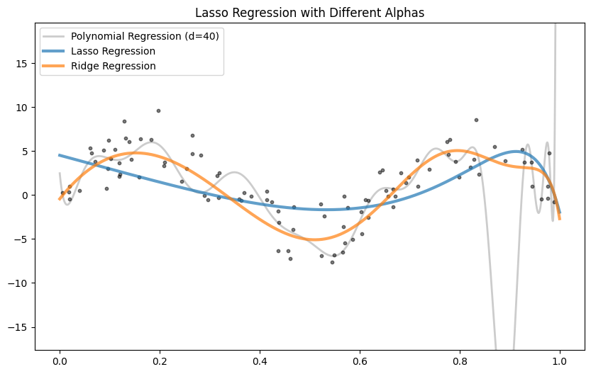
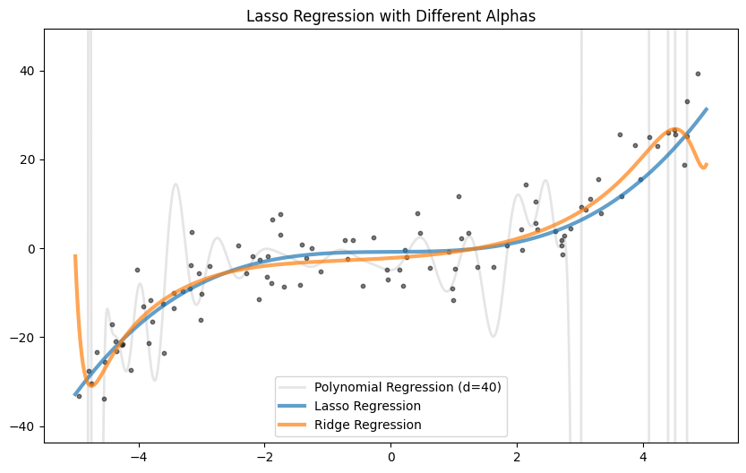
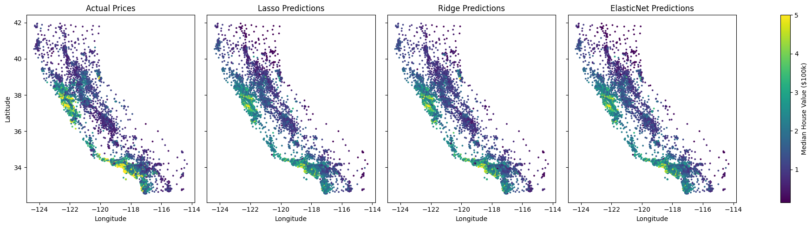

Last time we saw how [Polynomial regression](polynomial-regression) can fit complex patterns, but as we increased the degree of the polynomial, we encountered **overfitting**; the model performs well on the training data but poorly on unseen test data.

**Regularization** helps combat overfitting by adding a penalty term to the loss function, discouraging overly complex models.
We'll explore three common regularization techniques: **Ridge**, **Lasso**, and **Elastic Net**.

---

### Ridge Regression

Ridge adds a penalty proportional to the **squared magnitude** of coefficients:

$$
\text{Loss} = \text{MSE} + \alpha \sum_j w_j^2
$$

- Encourages smaller coefficients
- Doesn't eliminate features completely
- Tends to reduce model complexity and variance

---

### Lasso Regression

Lasso adds a penalty proportional to the **absolute value** of coefficients:

$$\text{Loss} = \text{MSE} + \alpha \sum_j |w_j|$$

- Can shrink some coefficients to **exactly zero**
- Useful for feature selection
- Produces sparse models


```python
import numpy as np
from sklearn.pipeline import make_pipeline
from sklearn.model_selection import train_test_split
from sklearn.preprocessing import PolynomialFeatures, StandardScaler
from sklearn.linear_model import Lasso, Ridge, ElasticNet

X = np.random.rand(100)
y = 5*np.sin(3 * np.pi * X) + np.random.normal(0, 2, X.shape)

X_train, X_test, y_train, y_test = train_test_split(X, y, test_size=0.5, random_state=42)

degree = 40

model = make_pipeline(PolynomialFeatures(degree), StandardScaler(), LinearRegression())
model.fit(X_train, y_train)

lasso_model = make_pipeline(PolynomialFeatures(degree), StandardScaler(), Lasso(0.1,max_iter=10000))
lasso_model.fit(X_train, y_train)

ridge_model = make_pipeline(PolynomialFeatures(degree),StandardScaler(), Ridge(0.0001))
ridge_model.fit(X_train, y_train)
```





In this example Ridge Regression works best, since the sinus function is non polynomial.


```python
n_samples = 100
X = np.random.uniform(-5, 5, size=(n_samples, 1))
y_true = 0.3 * X[:,0] * X[:,0] * X[:,0]
y = y_true + np.random.normal(scale=6.0, size=n_samples)

X_train, X_test, y_train, y_test = train_test_split(X, y, test_size=0.5, random_state=42)

degree = 40

model = make_pipeline(PolynomialFeatures(degree), StandardScaler(), LinearRegression())
model.fit(X_train, y_train)

lasso_model = make_pipeline(PolynomialFeatures(degree), StandardScaler(), Lasso())
lasso_model.fit(X_train, y_train)

ridge_model = make_pipeline(PolynomialFeatures(degree),StandardScaler(), Ridge())
ridge_model.fit(X_train, y_train)

```



In the case of this function lasso regularization works best, as it selects the relevent features.

---

So **Ridge** prevents coefficients from exploding, but keeps all of them. Usefull when you suspect many features to be useful (dense solution). Or when features are **highly correlated**.

**Lasso** performs **feature selection** by setting some coefficients to zero But it can behave erratically when features are **highly correlated** — arbitrarily picking one and ignoring the others.

---

### Elastic Net

**Elastic Net** combines Ridge and Lasso, giving you the **stability of Ridge** and the **sparsity of Lasso**.

$$
\text{Loss} = \text{RSS} + \alpha \cdot \left[ \rho \cdot \sum |w_i| + (1 - \rho) \cdot \sum w_i^2 \right]
$$

* $\alpha$: overall regularization strength.
* $\rho$ (or `l1_ratio` in scikit-learn): mix between Lasso ($\ell_1$) and Ridge ($\ell_2$).


It is usefull, when you have **many correlated features**, but you want **sparsity**.


Here is an example using real data, comparing the 3 approaches:

```python
from sklearn.datasets import fetch_california_housing
from sklearn.linear_model import LassoCV, RidgeCV, ElasticNetCV

data = fetch_california_housing()
X, y = data.data, data.target
longitude = X[:, data.feature_names.index('Longitude')]
latitude = X[:, data.feature_names.index('Latitude')]

degree = 5
lasso = make_pipeline(PolynomialFeatures(degree), StandardScaler(), LassoCV(n_jobs=8))
ridge = make_pipeline(PolynomialFeatures(degree), StandardScaler(), RidgeCV())
elastic = make_pipeline(PolynomialFeatures(degree), StandardScaler(), ElasticNetCV(n_jobs=8)

lasso.fit(X, y)
ridge.fit(X, y)
elastic.fit(X, y)
```


    Lasso MSE: 0.4795
    Ridge MSE: 0.3778
    ElasticNet MSE: 0.4766
