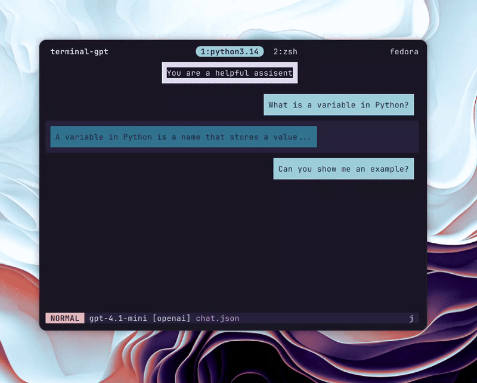

# Terminal GPT 

From my usage of ChatGPT while working in the terminal I noticed a couple of things.

Normally I have a simple question, need to copy part of the output, and go back to the terminal. For a keyboard-focused workflow, switching to the browser every few minutes gets tedious. So I set out to build something you can use without leaving the shell.

## Why I built it

I like to edit the conversation history. If the model makes a small mistake in an earlier reply, I want to correct that message so follow-ups don’t keep repeating the same error. I also live in Vim, so I tried to port as many Vim-like keybindings into the app as possible.

That’s why I created Terminal GPT: a terminal TUI that makes it fast and easy to edit, delete, or add messages in the conversation history. From my experience with language models, keeping the context clean is huge. Terminal GPT lets me ask a quick question about a project and, if the response isn’t relevant, delete it and retry. No browser required.

## What it does

* Vim-like interface and modes inspired by Vim (Normal, Insert, Visual).
* Real-time streaming: watch model responses stream as they’re generated.
* Message editing: edit any message inline with Vim motions or open it in your external editor.
* Model selection on the fly.
* Save/load chats as JSON and render them back to the terminal.
* Configurable providers and models via a TOML file.



## My favourite feature

Being able to open any response in Vim, select the relevant passages with all my custom keybinds and syntax highlighting, then close the chat and paste the answer into my project, all without leaving the terminal.

Pressing the external editor hotkey opens the current message in your `$EDITOR` — edit, save, quit, and the chat updates. It is the thing I miss most everytime I have to write / edit text in the browser.

## Quick demo

Start a chat with the default model:

```bash
terminal_gpt
```

Start with a specific model:

```bash
terminal_gpt --model gpt-4.1-mini
```

Render a chat file to the terminal:

```bash
render_chat ~/chats/my_chat.json
render_chat ~/chats/my_chat.json 120  # specify width
```

This was basically build to browse chat files using `fzf --preview=render_chat`.

## Keybindings

Normal mode (default)

* `i`, `a` — enter insert mode at cursor
* `j`, `k` — move between messages
* `dd` — delete current message
* `Ctrl+e` — edit message in external editor
* `Ctrl+p` — model selection popup
* `Enter` — send message / get response
* `gg`, `G` -- go up / down the entire page

Visual mode

* `j/k` to select, `d` to delete selection, `h/l` to switch roles

Insert mode is just typing — `Esc` to go back to Normal.

## Under the hood

The app is built with `urwid` for the terminal UI and uses `litellm` as a provider abstraction layer. Currently I have an OpenAI backend wired up, but the design lets you add other providers easily via a `models/` implementation.

Key custom pieces:

* `ChatHistory` and `EditableChatBubble` widgets
* `VimKeyHandler` parsing modes and motions
* `VimHeader` status bar showing mode, model, and key sequences

I rely on libraries like urwid and litellm; both made building a terminal chat far less painful.

## Install & config

Clone and install from source:

```bash
git clone https://github.com/yourusername/terminal-gpt.git
cd terminal-gpt
pip install -e .
```

Create `~/.config/terminal_gpt/config.toml` to define your default model and providers (you can use `api_key_cmd` to fetch keys from a password manager).

## Final thoughts

Terminal GPT is small and opinionated: it assumes you prefer keyboard control, short feedback loops, and keeping context tidy. It’s not trying to replace the full browser experience — it’s for the times you just want a quick, terminal-native chat, edit it like code, and paste the useful bits into whatever you’re building.

If you like the idea, check the repo README for the demo and full keybinding list. I’d love to see how people adapt the workflow — branching chats, experimental prompts, or maybe building richer integrations with editors and tooling.

Got feedback or want a feature? Open an issue or a PR — contributions are welcome.

